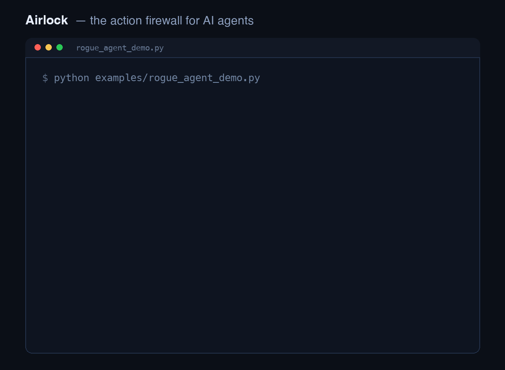
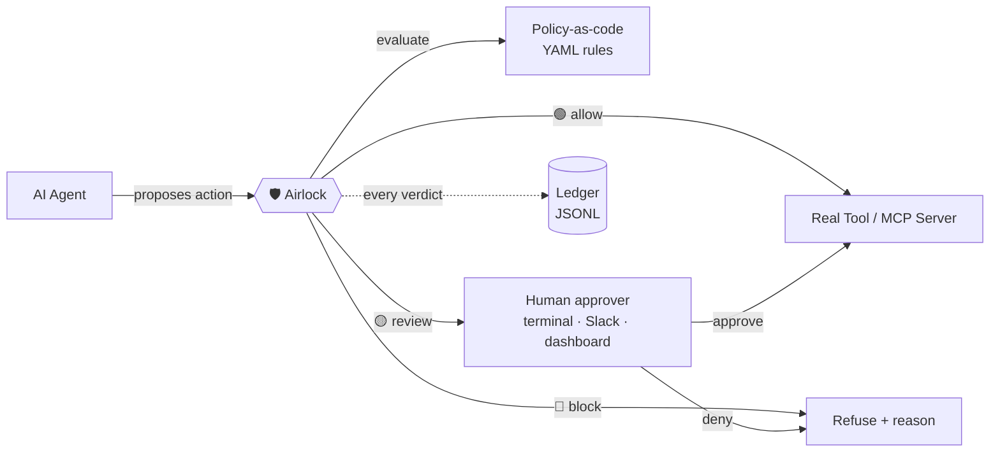

<div align="center">

# 🛡️ Airlock

### The action firewall for AI agents.

**Your agents can think freely. Nothing dangerous gets _executed_ without passing the airlock.**

Policy-as-code · human-in-the-loop approval · full ledger — at the one boundary that matters: where an agent's *decision* becomes a real-world *action*.

[](#) [](#) [](LICENSE) [](#contributing)

<!-- ▶ DEMO GIF GOES HERE — record examples/rogue_agent_demo.py (see launch/DEMO_SCRIPT.md) -->


*An over-eager agent tries to `DROP TABLE customers`, refund $25,000, and delete your S3 backups. Airlock allows the safe one, blocks the dangerous ones with a readable reason, and routes the ambiguous one to a human — without changing a line of agent logic.*

</div>

---

## Why this exists

On **April 25, 2026**, an AI coding agent deleted a company's production database *and its backups* in **nine seconds**. In March, a rogue agent at a major tech company exposed internal data to unauthorized employees. The 2026 CISO AI Risk Report found **47% of security leaders have watched agents take unauthorized actions — and only 5% feel confident they could contain a compromised one.**

Meanwhile **85% of enterprises are customizing agents, but only 21% have a mature governance model** (Deloitte, 2026).

That gap is the whole problem. We spend enormous effort making agents *smarter* and almost none making their *actions* accountable. Content filters catch bad **words**. Airlock catches bad **actions** — the `DROP TABLE`, the six-figure refund, the `rm -rf` on a backup volume — at the exact moment the agent tries to execute them.

> **Give your agents autonomy without the nine-second production-database deletion.**

## The one thing Airlock does

It sits at your agent's **tool-execution boundary** and, for every proposed action, returns one of three decisions from a policy *a non-engineer can read*:

| Decision | Meaning | Example |
|----------|---------|---------|
| 🟢 **ALLOW** | Safe under policy — execute it | `refund($75)` |
| 🔴 **BLOCK** | Forbidden — refuse and raise | `DROP TABLE customers` |
| 🟡 **REVIEW** | Ambiguous — pause for a human | `refund($25,000)` |

Every attempt — allowed, blocked, or escalated — lands in an **ledger** you can hand to a risk or compliance reviewer. That's the artifact they actually ask for.

## Quickstart (60 seconds)

```bash
git clone https://github.com/APK99-dot/Airlock && cd Airlock
pip install pyyaml                            # the only runtime dependency
python examples/rogue_agent_demo.py           # watch the firewall work
python examples/rogue_agent_demo.py --human   # you approve/deny the $25k refund
```

> The demo runs straight from the clone — no install step. Prefer it on your path?
> `pip install -e .` (needs pip ≥ 21.3) installs the `airlock` package.

Add it to your own agent in **one line per tool**:

```python
from airlock import Airlock

lock = Airlock.from_file("policies/example.yaml")

@lock.guard("payments.refund")
def issue_refund(amount: float, account: str) -> str:
    ...   # your real tool. Airlock enforces policy before it ever runs.
```

…or check imperatively at any framework's tool boundary:

```python
verdict = lock.check("db.execute", {"query": sql})
if verdict.allowed:
    run(sql)
else:
    log.warning(verdict.reason)   # "Destructive SQL is not permitted."
```

## Policy-as-code (the part your CISO can read)

```yaml
default: allow
rules:
  - name: block-destructive-sql
    match:
      action: "db.*"
      args: { query: "(?i)\\b(drop|truncate|delete\\s+from)\\b" }
    decision: block
    reason: "Destructive SQL is not permitted on this database."

  - name: review-large-refunds
    match:
      action: "payments.refund"
      when: "float(args.get('amount', 0)) > 10000"
    decision: review
    reason: "Refunds over $10,000 require human approval."
```

First match wins. Match on the **action name** (glob), **argument content** (regex), or a **`when` expression**. See [`policies/example.yaml`](policies/example.yaml).

## Works where your agents already run

- **Any Python agent** — the `@guard` decorator or `lock.check()`
- **MCP servers** — [`AirlockMCPProxy`](src/airlock/integrations/mcp.py) sits in front of any MCP server; blocked `tools/call`s never reach it and return a structured error the agent can reason about
- **LangChain / LangGraph** — [`AirlockCallbackHandler`](src/airlock/integrations/langchain.py) guards tools at `on_tool_start`

## Architecture



Airlock is deliberately **one layer** of the guardrail stack — the **action layer**. It composes with content/prompt-injection filters (NeMo Guardrails, Galileo) rather than replacing them.

## What Airlock is *not* (non-goals)

- ❌ Not a content moderator or prompt-injection text filter — that's a different layer; run one alongside.
- ❌ Not a model host, eval platform, or observability suite.
- ❌ Not enterprise IAM/SSO/RBAC — it enforces *policy*, and hands identity to your existing stack.
- ❌ Not a code sandbox — it decides *whether* an action runs, not *where*.

Doing one thing at the right boundary is the point.

## How it compares

| | Content filters (NeMo, Galileo) | Heavyweight platforms | **Airlock** |
|---|:---:|:---:|:---:|
| Catches bad **actions** (not just words) | ➖ | ✅ | ✅ |
| Policy a non-engineer can read | ➖ | ➖ | ✅ |
| One-line to add to an existing agent | ➖ | ➖ | ✅ |
| MCP-native proxy | ➖ | partial | ✅ |
| Runs local, no account, MIT | ✅ | ➖ | ✅ |

## Roadmap

- [ ] Slack + web-dashboard approvers (dashboard scaffold in [`dashboard/`](dashboard/))
- [ ] Policy simulator: replay an ledger against a proposed policy diff
- [ ] Signed, hash-chained ledger for tamper evidence
- [ ] Prebuilt policy packs (fintech, healthcare, internal-tools)

## Contributing

Issues and PRs welcome — especially real-world "an agent tried to do *this*" policy rules. See [CONTRIBUTING.md](CONTRIBUTING.md).

## License

MIT © APK99-dot

<div align="center"><sub>Built because agents should be autonomous — not unaccountable.</sub></div>
