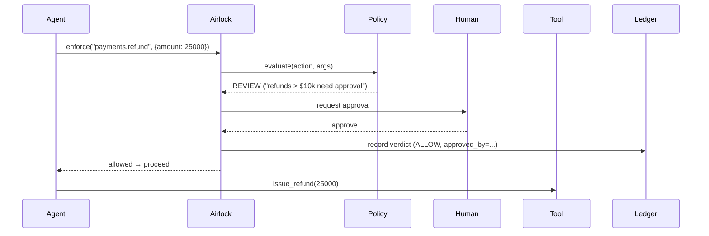

# Architecture

Airlock is small on purpose. It does one job — decide whether a proposed agent
action may execute — at one place: the tool-call boundary.

## The request lifecycle



A `BLOCK` short-circuits before the tool is ever called; the agent receives a
`BlockedActionError` (or, over MCP, a structured tool error it can reason about).

## Components

| Module | Responsibility |
|--------|----------------|
| `policy.py`    | Parse policy-as-code; first-match-wins evaluation (`action` glob, `args` regex, `when` expression) |
| `core.py`      | `Airlock`: `check`, `enforce`, `@guard`; resolves REVIEW via an approver |
| `approvals.py` | Pluggable approvers: terminal, auto-deny (fail-closed default), callback/Slack |
| `ledger.py`     | Append-only JSONL trail + live subscribers for the dashboard |
| `decisions.py` | `Decision`, `Verdict`, `BlockedActionError` — dependency-free core types |
| `integrations/mcp.py` | Proxy that guards `tools/call` in front of any MCP server |
| `integrations/langchain.py` | Callback handler guarding tools at `on_tool_start` |

## Where Airlock sits in the guardrail stack

The 2026 consensus is that "AI guardrails" spans four layers — **content**,
**evaluation**, **sandbox**, and **action** — and most production agents need
two or three. Airlock owns the **action layer** and composes with the rest:

```
 prompt ─► [content filter] ─► LLM ─► [eval] ─► proposed action ─► 🛡️ AIRLOCK ─► tool
           NeMo / Galileo            judges                        this project
```

## Design principles

1. **Guard the boundary, not the brain.** We don't constrain what the model
   thinks — only what it's allowed to *do*.
2. **Fail closed.** No approver wired up? `REVIEW` becomes `BLOCK`.
3. **Readable policy.** A risk reviewer should understand a rule without a
   developer translating it.
4. **One line to adopt.** If integration is expensive, no one turns it on.
5. **Everything is logged.** The ledger is a first-class output, not an
   afterthought.
